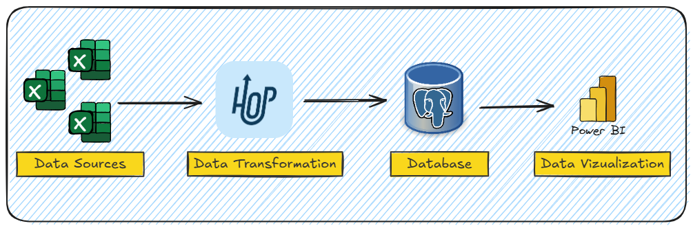
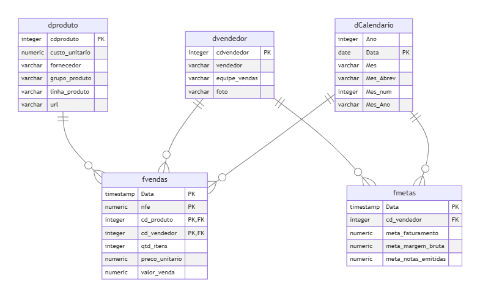

# Projeto: ETL de Planilhas Excel e Construção de BI de Vendas com Apache Hop e PostgreSQL

## Objetivo

Este repositório contém o projeto **Live Xperium Hop**, que integra pipelines de dados, workflows e dashboards em Power BI. O projeto utiliza Apache Hop para realizar ETL, juntamente com PostgreSQL para armazenamento estruturado dos dados.



### Ferramentas Utilizadas
- **Apache Hop**:
  - Orquestração de pipelines ETL.
  - Automação de transformações e fluxos de dados.
- **PostgreSQL**:
  - Armazenamento e modelagem dos dados de vendas.
  - Criação de tabelas dimensionais e de fatos.
- **Power BI**:
  - Criação de dashboards e relatórios interativos de vendas.

### Fontes de Dados
- **Planilhas Excel**: Contêm dados de vendas organizados em diferentes formatos.
  - Campos esperados: `Data da Venda`, `Produto`, `Cliente`, `Quantidade Vendida`, `Valor Unitário` e `Custo`.

---

## Arquitetura de Dados

### 1. **ETL**
- **Extração**:
  - Leitura de dados a partir de arquivos Excel.
- **Transformação**:
  - Limpeza e validação dos dados.
  - Conversão de formatos (e.g., datas e valores numéricos).
  - Cálculo de métricas, como o valor total das vendas (`Quantidade Vendida x Valor Unitário`).
- **Carga**:
  - Inserção dos dados processados no PostgreSQL em tabelas de dimensão e fato.

### 2. **Modelagem de Dados**


- **Dimensões**:
  - `dproduto`: Detalhes sobre os produtos.
  - `dcliente`: Informações sobre os clientes.
  - `dCalendario`: Estruturação temporal para análise por períodos.
- **Fatos**:
  - `fvendas`: Registro consolidado das vendas com métricas calculadas.
  - `fmetas`: Registro consolidado das metas com métricas calculadas.

---

## Estrutura do Repositório

A estrutura do repositório é organizada da seguinte forma:

```plaintext
LIVE_XPERIUM_HOP/
│
├── datasets/              # Arquivos de dados utilizados pelos pipelines
├── metadata/              # Configurações e metadados para os pipelines
├── pipelines/             # Pipelines de ETL do Apache Hop
├── workflow/              # Workflows para orquestração dos processos
│
├── .gitignore             # Arquivos e diretórios ignorados pelo Git
├── dashboard_vendas.pbix  # Dashboard de vendas no Power BI
├── project-config.json    # Configuração do projeto no Apache Hop
└── README.md              # Documentação do projeto
```

---

## Pré-requisitos

Certifique-se de que os seguintes softwares estão instalados na sua máquina:

- [Apache Hop](https://hop.apache.org/)
- [PostgreSQL](https://www.postgresql.org/)
- [Power BI Desktop](https://powerbi.microsoft.com/)
- [Git](https://git-scm.com/)

---

## Configuração do Ambiente

### 1. Clone este repositório
```bash
git clone https://github.com/seu_usuario/seu_repositorio.git
cd LIVE_XPERIUM_HOP
```

### 2. Configure o PostgreSQL
1. Instale o PostgreSQL em sua máquina seguindo as instruções disponíveis [aqui](https://www.postgresql.org/download/).
2. Após a instalação, crie um banco de dados para o projeto:
```sql
CREATE DATABASE DW;
```
3. Configure as tabelas e conexões executando os scripts fornecidos no arquivo `dw_vendas`.

### 3. Configure o Apache Hop
1. Baixe e instale o Apache Hop em sua máquina pelo site oficial: [Apache Hop](https://hop.apache.org/).
2. Abra o Apache Hop e importe os pipelines e workflows localizados nos diretórios `pipelines` e `workflow`.
3. Configure as variáveis de ambiente utilizando o arquivo `project-config.json`.

---

## Executando os Pipelines

1. Inicie o Apache Hop e carregue os pipelines do diretório `pipelines`.
2. Configure as conexões com o banco de dados utilizando os arquivos em `metadata`.
3. Execute os workflows do diretório `workflow` para orquestrar os processos ETL.

---

## Dashboard em Power BI

O arquivo `dashboard_vendas.pbix` contém o dashboard de vendas. Para utilizá-lo:

1. Abra o arquivo no Power BI Desktop.
2. Atualize as conexões de dados para o ambiente configurado.
3. Publique o relatório no Power BI Service, se necessário.

---

## Contribuição

Contribuições são bem-vindas! Para contribuir:

1. Faça um fork do projeto.
2. Crie uma branch para suas alterações (`git checkout -b feature/nova-feature`).
3. Envie suas alterações (`git push origin feature/nova-feature`).
4. Abra um Pull Request.

---

## Direitos de Uso

Este projeto tem como objetivo demonstrar um processo de ETL utilizando Apache Hop. O conteúdo deste repositório pode ser utilizado livremente, desde que o autor não seja responsabilizado por eventuais danos ou problemas decorrentes do uso.

Exigido | Permitido | Proibido
:---: | :---: | :---:
Aviso de licença e direitos autorais | Uso comercial | Responsabilidade Assegurada
 || Modificação ||	
 || Distribuição ||	
 || Sublicenciamento || 


---

## Contato

Dúvidas ou sugestões? Entre em contato:
- **Email**: alexdesousapereiraa@gmail.com
- **LinkedIn**: [Alex Pereira](https://www.linkedin.com/in/alex-pereira-analista-dados-sqldevelope-businessanalytics-datascience/)
